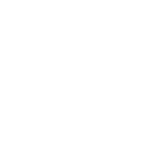

<!-- Project Logo -->
<div align="center">
  <a href="https://github.com/dwghdev/todo-app-MERN">
    
  </a>

  <h3 align="center">Todo App MERN</h3>
  <p align="center">A Simple Todo App</p>

  `` LIVE: https://dwghdev.github.io/todo-app-MERN ``

  `` API: https://todo-api-mern-exam.herokuapp.com/api/todos ``

</div>
<details>
  <summary>Contents</summary>
    <ul>
      <li>
        <a href="#getting-started">Getting Started</a>
      </li>
      <li>
        <a href="#features">Features</a>
      </li>
      <li>
        <a href="#api-routes">API Routes</a>
      </li>
    </ul>
</details>

## Application View Sample
<div align="center">
  
</div>

## Getting Started
  - clone the project and then start the project
```
  git clone https://github.com/dwghdev/todo-app-MERN 
  cd todo-app-MERN

  # open server
    cd server
    npm install
    npm start

  # open client
    cd ../client
    npm install
    npm start
```

## Features
- [x] create a todo with title and description.
- [x] edit/update a todo with title and description.
- [x] filter a todos if completed, active or all.
- [x] deleting a todo and invalidating the list.
- [x] marking a todo as completed or active.

<p align="right">(<a href="#top">back to top</a>)</p>

## API Routes
 Create a todo task: ``POST /todos``

 Get all todo tasks: ``GET /todos``

 Get todo task by id: ``GET /todos/:id``

 Update/Edit a todo task : ``PUT /todos/:id``

 Delete/Remove todo task : ``DELETE /todos/:id``

 Get completed todo tasks: ``GET /todos?isCompleted=true``

<p align="right">(<a href="#top">back to top</a>)</p>
